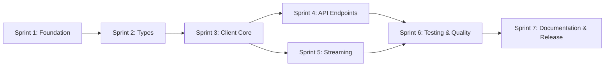

# Roadmap: ollama-haskell v1.0

> **Version:** 1.0  
> **Status:** Draft  
> **Author:** Tushar Adhatrao  
> **Last Updated:** 2026-07-23  
> **Prerequisites:** [PRD.md](./PRD.md), [TDD.md](./TDD.md)

---

## Overview

This roadmap breaks the v1.0 rewrite into **7 sprints** of approximately **1–2 weeks each**. Each sprint is self-contained with clear deliverables, acceptance criteria, and dependencies. Sprints are designed so that multiple developers can work in parallel where possible.

The sprints follow a strict build order: **Foundation → Types → Client → API → Streaming → Testing → Polish**.

---

## Sprint Dependency Graph



---

## Sprint 1: Foundation & Project Scaffold

**Duration:** ~1 week  
**Parallel:** No (must be done first)  
**Goal:** Set up the new project structure, build system, CI, and tooling.

### Tasks

- [x] **S1.1** — Upgrade `cabal-version` to `3.0`. Define `common` stanzas for `warnings` and `lang`.
- [x] **S1.2** — Set `default-language: GHC2021`. Add `default-extensions` as specified in [TDD §2.2](./TDD.md#22-default-language-extensions).
- [x] **S1.3** — Remove per-file `{-# LANGUAGE #-}` pragmas that are now covered by `default-extensions`.
- [x] **S1.4** — Create the new module hierarchy directories:
  ```
  src/Ollama/
  src/Ollama/Client/
  src/Ollama/API/
  src/Ollama/API/Models/
  src/Ollama/Types/
  src/Ollama/Types/Format/
  ```
- [x] **S1.5** — Set up `test/` directory with the new structure (Unit, Property, Golden, Integration).
- [x] **S1.6** — Add `integration-tests` cabal flag (default: `False`).
- [x] **S1.7** — Set up GitHub Actions CI pipeline:
  - GHC matrix: 9.4, 9.6, 9.8, 9.10
  - Jobs: build, test, hlint, fourmolu check, cabal check, haddock build
- [x] **S1.8** — Configure `fourmolu.yaml` for the project.
- [x] **S1.9** — Configure `.hlint.yaml` with custom rules (ban `head`, `tail`, `fromJust`, `read`, `error`, `undefined`).
- [x] **S1.10** — Add a `Makefile` with targets: `build`, `test`, `lint`, `format`, `docs`, `clean`.
- [x] **S1.11** — Create stub `ARCHITECTURE.md`, `CONTRIBUTING.md` files.
- [x] **S1.12** — Update `.gitignore` for new structure.

### Acceptance Criteria

- `cabal build` succeeds with GHC 9.4+ (even if modules are stubs).
- `cabal test` runs (even if zero test cases).
- CI pipeline is green on all matrix entries.
- `hlint src/` and `fourmolu --check src/` pass.

### Files Created/Modified

| Action | File |
|--------|------|
| MODIFY | `ollama-haskell.cabal` |
| MODIFY | `package.yaml` (or remove if going cabal-only) |
| CREATE | `src/Ollama.hs` (stub re-export) |
| CREATE | `.github/workflows/ci.yml` |
| CREATE | `.hlint.yaml` |
| MODIFY | `fourmolu.yaml` |
| CREATE | `Makefile` |
| CREATE | `ARCHITECTURE.md` |
| CREATE | `CONTRIBUTING.md` |

---

## Sprint 2: Core Types & Error Handling

**Duration:** ~1.5 weeks  
**Parallel:** Can be split across 2 developers (Types / Error+Config)  
**Goal:** Define all public types, newtypes, smart constructors, JSON instances, and the error type.

### Tasks

#### Track A: Domain Types

- [x] **S2.1** — Implement `Ollama.Types.Common`: `ModelName`, `Digest`, `Base64Image`, `Duration`, `Version`, `Think`, `ThinkingLevel`. Include smart constructors and JSON instances.
- [x] **S2.2** — Implement `Ollama.Types.Message`: `Role`, `Message`, all smart constructors (`userMessage`, `systemMessage`, `assistantMessage`, `toolMessage`, `toolResultMessage`, `imageMessage`). Custom `ToJSON`/`FromJSON`.
- [x] **S2.3** — Implement `Ollama.Types.Tool`: `Tool`, `FunctionDef`, `FunctionParameters`, `ToolCall`, `ToolCallFunction`. Custom JSON instances.
- [x] **S2.4** — Implement `Ollama.Types.Options`: `ModelOptions` with all fields from [API spec](./api.md) including `draft_num_predict`. Custom `ToJSON` that omits `Nothing` fields.
- [x] **S2.5** — Implement `Ollama.Types.Format`: `Format` (`JsonFormat`, `SchemaFormat`). Migrate and improve `SchemaBuilder` DSL to `Ollama.Types.Format.SchemaBuilder`.
- [x] **S2.6** — Implement `Ollama.Types.Model`: `ModelInfo`, `ModelDetails`, `RunningModel`, `RunningModelsResponse`, `ListResponse`. Custom `FromJSON`.

#### Track B: Error & Config

- [x] **S2.7** — Implement `Ollama.Error`: `OllamaError` sum type (5 constructors), `Exception` instance, proper `Eq`, `isRetryable`, `throwOllama`.
- [x] **S2.8** — Implement `Ollama.Client.Config`: `OllamaClientConfig`, `RetryPolicy`, `LogLevel`, `defaultConfig`.
- [x] **S2.9** — Create `Ollama.Types` re-export module that exposes all public types.

### Acceptance Criteria

- All types compile and have `ToJSON`/`FromJSON` instances.
- All smart constructors validate inputs (e.g., `mkModelName` rejects empty text).
- `OllamaError` has a working `Exception` instance.
- JSON roundtrip for all types verified by at least one manual test each.
- Zero HLint warnings. Fourmolu passes.

### Files Created

| Action | File |
|--------|------|
| CREATE | `src/Ollama/Types/Common.hs` |
| CREATE | `src/Ollama/Types/Message.hs` |
| CREATE | `src/Ollama/Types/Tool.hs` |
| CREATE | `src/Ollama/Types/Options.hs` |
| CREATE | `src/Ollama/Types/Format.hs` |
| CREATE | `src/Ollama/Types/Format/SchemaBuilder.hs` |
| CREATE | `src/Ollama/Types/Model.hs` |
| CREATE | `src/Ollama/Types.hs` |
| CREATE | `src/Ollama/Error.hs` |
| CREATE | `src/Ollama/Client/Config.hs` |

---

## Sprint 3: Client Core & HTTP Layer

**Duration:** ~1.5 weeks  
**Parallel:** No (everything else depends on this)  
**Goal:** Build the `OllamaClient`, HTTP request infrastructure, retry logic, and env var support.

### Tasks

- [x] **S3.1** — Implement `Ollama.Client`: `OllamaClient` (abstract type), `newClient`, `defaultClient`, `closeClient`, `withClient`.
- [x] **S3.2** — Implement `clientFromEnv`: Read `OLLAMA_HOST` and `OLLAMA_API_KEY` from environment variables. Parse host URL robustly (handle `host:port`, `http://host:port`, bare `host`).
- [x] **S3.3** — Implement `Ollama.Client.Internal.request`:
  - Resolve full URL from base URL + endpoint.
  - Set `Content-Type: application/json` and `Accept: application/json`.
  - Apply `Authorization: Bearer <key>` if configured.
  - Apply custom headers.
  - Handle JSON decode of response body.
  - Map HTTP errors to `OllamaError` constructors.
- [x] **S3.4** — Implement `Ollama.Client.Internal.requestRaw`: For non-JSON endpoints (blobs).
- [x] **S3.5** — Implement retry logic using the `retry` package:
  - `NoRetry`: No retries.
  - `ConstantRetry count delay`: Fixed interval.
  - `ExponentialRetry count initialDelay`: Exponential backoff.
  - Only retry on `isRetryable` errors.
- [x] **S3.6** — Implement lifecycle callbacks: Fire `configOnStart` before request, `configOnSuccess` on 2xx, `configOnError` on failure.
- [x] **S3.7** — Implement optional logging: Call `configLogger` with structured log messages at appropriate levels.
- [x] **S3.8** — Ensure `Manager` reuse: If `configManager` is `Just`, use it. Otherwise create one per `OllamaClient` and reuse it.

### Acceptance Criteria

- `defaultClient` connects to `http://127.0.0.1:11434`.
- `clientFromEnv` reads `OLLAMA_HOST` correctly.
- `request` produces correct HTTP requests (verify with a test against a mock or local server).
- Retry logic fires correct number of times.
- Callbacks fire at correct lifecycle points.
- `withClient` properly closes the manager.

### Files Created

| Action | File |
|--------|------|
| CREATE | `src/Ollama/Client.hs` |
| CREATE | `src/Ollama/Client/Internal.hs` |

---

## Sprint 4: API Endpoints

**Duration:** ~2 weeks  
**Parallel:** Yes — each endpoint module can be worked on independently once Sprint 3 is done.  
**Goal:** Implement all non-streaming API endpoint functions.

### Task Breakdown by Developer

#### Developer A: Core AI Endpoints

- [x] **S4.1** — `Ollama.API.Generate`: `GenerateRequest`, `GenerateResponse`, `generateRequest` smart constructor, `generate` function.
- [x] **S4.2** — `Ollama.API.Chat`: `ChatRequest`, `ChatResponse`, `chatRequest` smart constructor, `chat` function.
- [x] **S4.3** — `Ollama.API.Embed`: `EmbedRequest`, `EmbedResponse`, `embedRequest` smart constructor, `embed` function.

#### Developer B: Model Management Endpoints

- [x] **S4.4** — `Ollama.API.Models`: `listModels`, `showModel`, `copyModel`, `deleteModel` with all request/response types.
- [x] **S4.5** — `Ollama.API.Models.Create`: `CreateRequest`, `CreateResponse`, `QuantizationType`, `createModel` (non-streaming).
- [x] **S4.6** — `Ollama.API.Models.Pull`: `PullRequest`, `PullResponse`, `pull` (non-streaming, blocks until complete).
- [x] **S4.7** — `Ollama.API.Models.Push`: `PushRequest`, `PushResponse`, `push` (non-streaming).

#### Developer C: Utility Endpoints

- [x] **S4.8** — `Ollama.API.Blobs`: `checkBlob` (HEAD request), `pushBlob` (POST with raw body).
- [x] **S4.9** — `Ollama.API.Ps`: `listRunning`, `RunningModelsResponse`, `RunningModel`.
- [x] **S4.10** — `Ollama.API.Version`: `getVersion`.
- [x] **S4.11** — `Ollama.Conversation`: Migrate `ConversationStore` typeclass and `InMemoryStore` to new type system.

### Acceptance Criteria (per endpoint)

For each API endpoint:
1. Request type has a smart constructor.
2. JSON serialization matches the wire format in `api.md` exactly.
3. Function compiles and type-checks with `MonadIO m =>` polymorphic signature (works in plain `IO` and transformer stacks).
4. At least one integration test (behind `integration-tests` flag).
5. Haddock on all exports with `@since 1.0.0.0`.

### Files Created

| Action | File |
|--------|------|
| CREATE | `src/Ollama/API/Generate.hs` |
| CREATE | `src/Ollama/API/Chat.hs` |
| CREATE | `src/Ollama/API/Embed.hs` |
| CREATE | `src/Ollama/API/Models.hs` |
| CREATE | `src/Ollama/API/Models/Create.hs` |
| CREATE | `src/Ollama/API/Models/Pull.hs` |
| CREATE | `src/Ollama/API/Models/Push.hs` |
| CREATE | `src/Ollama/API/Blobs.hs` |
| CREATE | `src/Ollama/API/Ps.hs` |
| CREATE | `src/Ollama/API/Version.hs` |
| CREATE | `src/Ollama/Conversation.hs` |

---

## Sprint 5: Streaming

**Duration:** ~1.5 weeks  
**Parallel:** Can overlap with Sprint 4 (depends only on Sprint 3)  
**Goal:** Implement `conduit`-based streaming for all streaming-capable endpoints.

### Tasks

- [x] **S5.1** — Add `conduit` and `conduit-extra` dependencies.
- [x] **S5.2** — Implement `Ollama.Client.Internal.requestStreaming`:
  - Open HTTP connection with `withResponse`.
  - Read chunks from `BodyReader`.
  - Parse each line-delimited JSON chunk.
  - Yield parsed values into `ConduitT`.
  - Stop when `isDone` returns `True`.
- [x] **S5.3** — Implement `Ollama.Streaming` module (public-facing streaming helpers/utilities).
- [x] **S5.4** — Add `generateStream` to `Ollama.API.Generate`.
- [x] **S5.5** — Add `chatStream` to `Ollama.API.Chat`.
- [x] **S5.6** — Add `pullStream` to `Ollama.API.Models.Pull`.
- [x] **S5.7** — Add `pushStream` to `Ollama.API.Models.Push`.
- [x] **S5.8** — Add `createModelStream` to `Ollama.API.Models.Create`.
- [x] **S5.9** — Add convenience function: `collectStream :: ConduitT () a IO () -> IO [a]`.
- [x] **S5.10** — Add convenience function: `foldStream :: (b -> a -> b) -> b -> ConduitT () a IO () -> IO b`.

### Acceptance Criteria

- `chatStream` yields intermediate `ChatResponse` chunks and terminates when `done=true`.
- `pullStream` yields progress updates with `total` and `completed` fields.
- All streaming functions can be consumed with standard `conduit` combinators (`sinkList`, `mapM_C`, etc.).
- Streaming does not buffer the entire response in memory.
- Integration test: stream a chat response, verify chunks arrive incrementally.

### Files Created/Modified

| Action | File |
|--------|------|
| CREATE | `src/Ollama/Streaming.hs` |
| MODIFY | `src/Ollama/Client/Internal.hs` (add `requestStreaming`) |
| MODIFY | `src/Ollama/API/Generate.hs` (add `generateStream`) |
| MODIFY | `src/Ollama/API/Chat.hs` (add `chatStream`) |
| MODIFY | `src/Ollama/API/Models/Pull.hs` (add `pullStream`) |
| MODIFY | `src/Ollama/API/Models/Push.hs` (add `pushStream`) |
| MODIFY | `src/Ollama/API/Models/Create.hs` (add `createModelStream`) |

---

## Sprint 6: Testing & Quality

**Duration:** ~2 weeks  
**Parallel:** Yes — Unit/Property/Golden tests can be split across developers.  
**Goal:** Achieve comprehensive test coverage and code quality standards.

### Tasks

#### Track A: Pure Unit Tests (no server required)

- [ ] **S6.1** — JSON roundtrip tests for all request/response types:
  - `GenerateRequest`, `GenerateResponse`
  - `ChatRequest`, `ChatResponse`
  - `EmbedRequest`, `EmbedResponse`
  - `Message`, `Role`, `Tool`, `ToolCall`
  - `ModelOptions`, `Think`, `ThinkingLevel`
  - `Format`, `Schema`
  - All model management request/response types
- [ ] **S6.2** — Validation tests for smart constructors:
  - `mkModelName ""` returns `Left`
  - `chatRequest` with valid messages succeeds
  - `generateRequest` with empty prompt behaviour
- [ ] **S6.3** — Config resolution tests:
  - `defaultConfig` has correct defaults
  - `RetryPolicy` serialization
- [ ] **S6.4** — SchemaBuilder DSL tests:
  - Build complex schemas with `|+`, `|++`, `|!`, `|!!`
  - Verify JSON output matches expected schema
- [ ] **S6.5** — Error type tests:
  - `isRetryable` returns correct values
  - `Eq` instance works correctly
  - `Exception` instance allows `throwIO`/`catch`

#### Track B: Property-Based Tests

- [ ] **S6.6** — Define `Arbitrary` instances for all public types in `Test.Ollama.Property.Arbitrary`.
- [ ] **S6.7** — Roundtrip property: `∀ x. decode (encode x) == Just x` for every type with both instances.
- [ ] **S6.8** — Idempotency property: `∀ x. encode (fromJust (decode (encode x))) == encode x`.
- [ ] **S6.9** — Smart constructor invariant: `mkModelName` never produces `ModelName ""`.

#### Track C: Golden Tests

- [ ] **S6.10** — Create golden files for representative JSON payloads (requests and responses) from `api.md`.
- [ ] **S6.11** — Golden test for `chatRequest` serialization.
- [ ] **S6.12** — Golden test for `generateRequest` serialization.
- [ ] **S6.13** — Golden test for `embedRequest` serialization.
- [ ] **S6.14** — Golden test for each model management request.

#### Track D: Integration Tests

- [ ] **S6.15** — Migrate existing integration tests to new API surface.
- [ ] **S6.16** — Integration test: basic chat roundtrip.
- [ ] **S6.17** — Integration test: streaming chat.
- [ ] **S6.18** — Integration test: generate with options.
- [ ] **S6.19** — Integration test: embeddings (single and batch).
- [ ] **S6.20** — Integration test: list models, show model.
- [ ] **S6.21** — Integration test: tool calling roundtrip.
- [ ] **S6.22** — Integration test: structured output (JSON format + schema format).
- [ ] **S6.23** — Integration test: thinking mode.
- [ ] **S6.24** — Integration test: timeout and retry behaviour.
- [ ] **S6.25** — Integration test: lifecycle callbacks.

#### Track E: Quality Tooling

- [ ] **S6.26** — Set up `doctest` and verify all Haddock examples compile and pass.
- [ ] **S6.27** — Run `weeder` and remove all dead code.
- [ ] **S6.28** — Run `stan` and address all findings.
- [ ] **S6.29** — Verify `cabal check` passes with zero warnings.
- [ ] **S6.30** — Verify `cabal haddock` builds with zero warnings.

### Acceptance Criteria

- Pure test suite runs without an Ollama server and passes in CI.
- Property tests cover all types with `ToJSON` + `FromJSON`.
- Golden tests lock down the JSON wire format.
- Integration tests pass against a local Ollama server.
- `doctest` passes.
- `cabal check` passes.
- `cabal haddock` produces complete documentation.

### Files Created

| Action | File |
|--------|------|
| CREATE | `test/Main.hs` |
| CREATE | `test/Test/Ollama/Unit/Types.hs` |
| CREATE | `test/Test/Ollama/Unit/Validation.hs` |
| CREATE | `test/Test/Ollama/Unit/Config.hs` |
| CREATE | `test/Test/Ollama/Unit/SchemaBuilder.hs` |
| CREATE | `test/Test/Ollama/Unit/Error.hs` |
| CREATE | `test/Test/Ollama/Property/Arbitrary.hs` |
| CREATE | `test/Test/Ollama/Property/Roundtrip.hs` |
| CREATE | `test/Test/Ollama/Golden/*.hs` |
| CREATE | `test/golden/*.golden` |
| CREATE | `test-integration/Main.hs` |
| CREATE | `test-integration/Test/Ollama/Integration/*.hs` |

---

## Sprint 7: Documentation, Top-Level Module & Release

**Duration:** ~1 week  
**Parallel:** Yes — Docs and the top-level module are independent.  
**Goal:** Complete all documentation, finalize the public API surface, and prepare for Hackage release.

### Tasks

#### Track A: Top-Level Module & Re-exports

- [ ] **S7.1** — Implement `Ollama` (top-level re-export module):
  - Re-export the most commonly used symbols from all submodules.
  - Users should be able to do `import Ollama` and have everything they need for basic usage.
  - Less common types (e.g., `ShowModelInfo`, `SchemaBuilder` DSL) require qualified imports.
- [ ] **S7.2** — Finalize explicit export lists for every module.
- [ ] **S7.3** — Verify no orphan instances exist.

#### Track B: Documentation

- [ ] **S7.4** — Write `README.md` with:
  - Feature overview.
  - Installation instructions (cabal, stack).
  - Quick start: 5-line example from install to first API call.
  - Streaming example.
  - Tool calling example.
  - Structured output example.
  - Configuration (env vars, custom config).
  - Link to Hackage docs.
- [ ] **S7.5** — Write `ARCHITECTURE.md`:
  - Module dependency diagram.
  - Design decisions and rationale.
  - How to add a new API endpoint.
- [ ] **S7.6** — Write `CONTRIBUTING.md`:
  - Development setup (GHC, cabal, Ollama server).
  - Code style (fourmolu, hlint).
  - PR process and CI requirements.
  - Testing guidelines (pure vs integration).
- [ ] **S7.7** — Write `CHANGELOG.md` for v1.0.0.0:
  - Breaking changes from v0.2.x.
  - New features.
  - Migration guide summary.
- [ ] **S7.8** — Review all Haddock documentation:
  - Every exported symbol has docs.
  - Every module has module-level docs.
  - All `@since 1.0.0.0` annotations present.
- [ ] **S7.9** — Add comprehensive examples to `examples/` directory:
  - `BasicChat.hs` — Simple chat interaction.
  - `StreamingChat.hs` — Streaming with conduit.
  - `ToolCalling.hs` — Tool/function calling.
  - `StructuredOutput.hs` — JSON schema structured output.
  - `Embeddings.hs` — Batch embeddings.
  - `ModelManagement.hs` — Pull, list, show, delete models.

#### Track C: Release Preparation

- [ ] **S7.10** — Run full CI pipeline and fix any remaining issues.
- [ ] **S7.11** — Run `cabal sdist` and verify the tarball is clean.
- [ ] **S7.12** — Upload as Hackage candidate and verify docs render correctly.
- [ ] **S7.13** — Tag release `v1.0.0.0`.
- [ ] **S7.14** — Publish to Hackage.
- [ ] **S7.15** — Create GitHub Release with changelog.

### Acceptance Criteria

- `import Ollama` provides a complete, usable API surface.
- README contains working copy-paste examples.
- Hackage candidate uploads successfully and docs render.
- All CI checks pass on the release tag.
- CHANGELOG accurately describes all changes.

### Files Created/Modified

| Action | File |
|--------|------|
| MODIFY | `src/Ollama.hs` (finalize re-exports) |
| MODIFY | `README.md` |
| MODIFY | `CHANGELOG.md` |
| MODIFY | `ARCHITECTURE.md` |
| MODIFY | `CONTRIBUTING.md` |
| CREATE | `examples/BasicChat.hs` |
| CREATE | `examples/StreamingChat.hs` |
| CREATE | `examples/ToolCalling.hs` |
| CREATE | `examples/StructuredOutput.hs` |
| CREATE | `examples/Embeddings.hs` |
| CREATE | `examples/ModelManagement.hs` |

---

## Summary Timeline

| Sprint | Name | Duration | Depends On | Parallelizable |
|:------:|------|:--------:|:----------:|:--------------:|
| 1 | Foundation & Scaffold | 1 week | — | No |
| 2 | Core Types & Errors | 1.5 weeks | Sprint 1 | Yes (2 tracks) |
| 3 | Client Core & HTTP | 1.5 weeks | Sprint 2 | No |
| 4 | API Endpoints | 2 weeks | Sprint 3 | Yes (3 developers) |
| 5 | Streaming | 1.5 weeks | Sprint 3 | Yes (parallel with S4) |
| 6 | Testing & Quality | 2 weeks | Sprint 4, 5 | Yes (5 tracks) |
| 7 | Docs & Release | 1 week | Sprint 6 | Yes (3 tracks) |

**Total estimated time:** ~10.5 weeks (single developer), ~6 weeks (2–3 developers).

---

## Post-v1.0 Roadmap (Future Sprints)

These items are explicitly **out of scope** for v1.0 but are planned for future releases:

### v1.1 — Ecosystem Integration
- [ ] `ollama-haskell-servant`: Servant client bindings auto-generated from API spec.
- [ ] `ollama-haskell-persistent`: Persistent-backed `ConversationStore` (SQLite, PostgreSQL).
- [ ] `ollama-haskell-logging`: Integrations with `katip`, `co-log`, `monad-logger`.

### v1.2 — Advanced Features
- [ ] OpenAI-compatible endpoint support (`/v1/chat/completions`).
- [ ] Batch API for processing multiple requests.
- [ ] Automatic model warm-up / health check utilities.
- [ ] Rate limiting and request queuing.

### v1.3 — Developer Experience
- [ ] Template Haskell for tool definition DSL (like `ollama-rs-macros`).
- [ ] `ollama-haskell-cli`: Command-line tool built on the library.
- [ ] Nix flake for reproducible development environment.

### v2.0 — Breaking Improvements
- [ ] Effect system migration (`effectful` or `polysemy`) instead of `mtl`.
- [ ] `Generics`-based auto-derivation of tool schemas from Haskell types.
- [ ] WebSocket support (if Ollama adds it).

---

## Risk Register

| Risk | Impact | Probability | Mitigation |
|------|:------:|:-----------:|------------|
| Ollama API changes during development | High | Medium | Pin to a specific Ollama version for testing; design types to be forward-compatible with optional fields |
| `conduit` adds complexity for simple use cases | Medium | Low | Provide non-streaming variants as primary API; streaming is opt-in |
| GHC 9.4 compatibility issues | Medium | Low | CI matrix catches these early; use `CPP` pragmas only if absolutely necessary |
| Breaking changes alienate existing users | Medium | High | Provide clear migration guide in CHANGELOG; this is an explicit non-goal per PRD |
| Hackage upload issues | Low | Low | Test with candidate upload before release |
| Integration tests flaky in CI | Medium | High | Keep integration tests behind a flag; run pure tests in CI always |

---

## Definition of Done (per Sprint)

A sprint is considered **done** when:

1. ✅ All tasks are marked complete.
2. ✅ All new code has Haddock documentation.
3. ✅ All new code passes `hlint` with zero warnings.
4. ✅ All new code passes `fourmolu --check`.
5. ✅ All existing tests still pass.
6. ✅ Any new tests pass.
7. ✅ CI pipeline is green on all GHC versions.
8. ✅ PR is reviewed and approved.
9. ✅ Changes are merged to `main`.

---

## How to Use This Roadmap

1. **Sprint Planning:** Pick a sprint. Assign tasks from the task list to developers.
2. **Task Estimation:** Each `S#.#` task is designed to be roughly 0.5–2 days of work.
3. **Branch Strategy:** One feature branch per sprint (e.g., `sprint-2-types`). PRs merged to `main`.
4. **Parallel Work:** Tasks within the same sprint marked with different "Track" letters can be worked on simultaneously.
5. **Blockers:** If a task is blocked, escalate to the maintainer. The dependency graph shows what must be done first.
