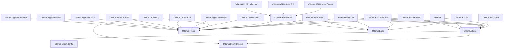

# TDD: ollama-haskell v1.0 — Technical Design Document

> **Version:** 1.0  
> **Status:** Draft  
> **Author:** Tushar Adhatrao  
> **Last Updated:** 2026-07-23  
> **Prerequisite:** [PRD.md](./PRD.md)

---

## 1. Overview

This document defines the technical design for the `ollama-haskell` v1.0 rewrite. It provides detailed module-level specifications, type definitions, function signatures, dependency choices, and coding patterns that developers should follow when implementing each sprint.

---

## 2. Technology Decisions

### 2.1 Language & Compiler

| Decision | Value | Rationale |
|----------|-------|-----------|
| Haskell Standard | GHC2021 | Modern defaults: `ImportQualifiedPost`, `DerivingStrategies`, `OverloadedStrings`, etc. |
| Minimum GHC | 9.4 | Drops legacy compat. GHC2021 extension set, improved error messages. |
| Build tool | Cabal (primary), Stack (secondary) | Hackage publishing requires cabal. Stack yaml files kept for convenience. |
| cabal-version | 3.0 | Supports `common` stanzas, `mixins`, better dependency management. |
| Default extensions (via `default-extensions` in cabal) | See §2.2 | Avoid per-file `{-# LANGUAGE #-}` pragmas for common extensions. |

### 2.2 Default Language Extensions

```yaml
default-extensions:
  - DerivingStrategies
  - DeriveGeneric
  - DeriveAnyClass
  - GeneralizedNewtypeDeriving
  - OverloadedStrings
  - ImportQualifiedPost
  - StrictData                   # All fields strict by default
  - TypeApplications
  - RecordWildCards
  - NamedFieldPuns
  - LambdaCase
  - MultiWayIf
  - ScopedTypeVariables
  - BangPatterns
```

> **Note:** `StrictData` replaces all manual `!` annotations on record fields. Every field is strict by default.

### 2.3 Key Dependencies

| Dependency | Purpose | Replaces |
|------------|---------|----------|
| `aeson >= 2.1` | JSON serialization/deserialization | Keep (already used) |
| `http-client` + `http-client-tls` | HTTP transport | Keep (already used) |
| `http-types` | HTTP status codes, headers | Keep (already used) |
| `conduit` + `conduit-extra` | Streaming responses | Callback tuples |
| `text >= 2.0` | UTF-8 text | Keep |
| `bytestring` | Binary data, request bodies | Keep |
| `containers` | `Map` for metadata | Keep |
| `time` | `UTCTime` timestamps | Keep |
| `mtl` | `MonadIO`, `MonadReader` | Keep |
| `unliftio-core` | `MonadUnliftIO` for resource safety | New |
| `retry` | Configurable retry policies | Custom `withRetry` |
| `stm` | `TVar` for conversation store | Keep |

### 2.4 Removed Dependencies

| Dependency | Reason for Removal |
|------------|--------------------|
| `base64-bytestring` | Replace with `base64` (more maintained, broader API) |
| `directory` + `filepath` | Move image encoding to a utility; not core library concern |

### 2.5 Test Dependencies

| Dependency | Purpose |
|------------|---------|
| `tasty` | Test framework (keep) |
| `tasty-hunit` | Unit test assertions (keep) |
| `tasty-golden` | Golden/snapshot tests for JSON |
| `tasty-quickcheck` or `hedgehog` | Property-based testing |
| `aeson-qq` or `aeson-pretty` | JSON literal construction in tests |
| `hspec` (optional) | Alternative test framework for BDD style |

### 2.6 Dev Dependencies

| Tool | Purpose |
|------|---------|
| `fourmolu` | Code formatter (already used) |
| `hlint` | Linter (already used) |
| `doctest` | Runnable Haddock examples |
| `weeder` | Dead code detection |
| `stan` | Static analysis |

---

## 3. Module Design

### 3.1 Module Dependency Graph



### 3.2 Dependency Rule

- `Ollama.Types.*` and `Ollama.Error` have **zero intra-library dependencies** (only depend on external packages).
- `Ollama.Client.*` depends only on `Ollama.Types.*` and `Ollama.Error`.
- `Ollama.API.*` depends on `Ollama.Client`, `Ollama.Types.*`, `Ollama.Error`.
- `Ollama.Streaming` depends on `Ollama.Client.Internal` and `Ollama.Types.*`.
- No circular dependencies. Enforce via import direction rule: Types → Client → API.

---

## 4. Core Type Definitions

### 4.1 Client

```haskell
-- Ollama.Client
module Ollama.Client
  ( OllamaClient    -- abstract, no constructor exported
  , newClient
  , defaultClient
  , clientFromEnv
  , closeClient
  , withClient
  ) where

-- | An opaque Ollama API client. Thread-safe. Reuse across requests.
data OllamaClient = OllamaClient
  { clientManager  :: !Manager
  , clientConfig   :: !OllamaClientConfig
  , clientOwned    :: !Bool  -- whether we created the Manager (and must close it)
  }

-- | Create a client with custom config.
newClient :: MonadIO m => OllamaClientConfig -> m OllamaClient

-- | Create a client with all defaults (localhost:11434, 90s timeout, no auth).
defaultClient :: MonadIO m => m OllamaClient

-- | Create a client from OLLAMA_HOST and OLLAMA_API_KEY env vars.
clientFromEnv :: MonadIO m => m OllamaClient

-- | Close the client's HTTP manager if we own it.
closeClient :: MonadIO m => OllamaClient -> m ()

-- | Bracket pattern: create, use, close.
withClient :: MonadUnliftIO m => OllamaClientConfig -> (OllamaClient -> m a) -> m a
```

### 4.2 Client Config

```haskell
-- Ollama.Client.Config
module Ollama.Client.Config
  ( OllamaClientConfig(..)
  , defaultConfig
  , RetryPolicy(..)
  , noRetry
  , constantRetry
  , exponentialRetry
  , LogLevel(..)
  ) where

data OllamaClientConfig = OllamaClientConfig
  { configBaseUrl    :: !Text
    -- ^ Base URL for the Ollama server. Default: "http://127.0.0.1:11434"
  , configTimeout    :: !Int
    -- ^ Timeout in seconds. Default: 90
  , configRetry      :: !RetryPolicy
    -- ^ Retry policy for failed requests. Default: noRetry
  , configManager    :: !(Maybe Manager)
    -- ^ Optional shared HTTP manager. If provided, timeout is ignored.
  , configHeaders    :: ![(CI ByteString, ByteString)]
    -- ^ Custom headers to send with every request.
  , configApiKey     :: !(Maybe Text)
    -- ^ API key for authentication (sent as Bearer token).
  , configLogger     :: !(Maybe (LogLevel -> Text -> IO ()))
    -- ^ Optional structured logger callback.
  , configOnStart    :: !(Maybe (IO ()))
    -- ^ Callback fired before each request.
  , configOnSuccess  :: !(Maybe (IO ()))
    -- ^ Callback fired after a successful request.
  , configOnError    :: !(Maybe (IO ()))
    -- ^ Callback fired after a failed request.
  }

data RetryPolicy
  = NoRetry
  | ConstantRetry !Int !Int        -- count, delaySeconds
  | ExponentialRetry !Int !Int     -- count, initialDelayMs

data LogLevel = Debug | Info | Warn | Error
  deriving (Eq, Ord, Show, Bounded, Enum)

defaultConfig :: OllamaClientConfig
defaultConfig = OllamaClientConfig
  { configBaseUrl   = "http://127.0.0.1:11434"
  , configTimeout   = 90
  , configRetry     = NoRetry
  , configManager   = Nothing
  , configHeaders   = []
  , configApiKey    = Nothing
  , configLogger    = Nothing
  , configOnStart   = Nothing
  , configOnSuccess = Nothing
  , configOnError   = Nothing
  }
```

### 4.3 Error Type

```haskell
-- Ollama.Error
module Ollama.Error
  ( OllamaError(..)
  , throwOllama
  , isRetryable
  ) where

data OllamaError
  = -- | HTTP transport error (connection refused, DNS failure, etc.)
    HttpError !HttpException
  | -- | Ollama API returned an error response (status code + body)
    ApiError !Int !Text
  | -- | Failed to decode JSON response
    DecodeError !Text !ByteString
  | -- | Request timed out waiting for a response
    TimeoutError
  | -- | Client-side validation failure before sending request
    InvalidRequest !Text
  deriving stock (Show, Typeable)

instance Exception OllamaError

instance Eq OllamaError where
  ApiError s1 t1    == ApiError s2 t2    = s1 == s2 && t1 == t2
  DecodeError t1 _  == DecodeError t2 _  = t1 == t2
  TimeoutError       == TimeoutError      = True
  InvalidRequest t1 == InvalidRequest t2 = t1 == t2
  HttpError _       == HttpError _       = False  -- HttpException has no Eq
  _                 == _                 = False

-- | Classify whether an error is transient and worth retrying.
isRetryable :: OllamaError -> Bool
isRetryable (HttpError _)  = True
isRetryable TimeoutError   = True
isRetryable _              = False

throwOllama :: HasCallStack => OllamaError -> IO a
throwOllama = throwIO
```

### 4.4 Domain Newtypes

```haskell
-- Ollama.Types.Common
module Ollama.Types.Common
  ( ModelName(..)
  , mkModelName
  , Digest(..)
  , Base64Image(..)
  , encodeImageFile
  , Duration(..)
  , durationToSeconds
  , durationToMillis
  , Version(..)
  ) where

-- | A model name following the model:tag format.
newtype ModelName = ModelName { unModelName :: Text }
  deriving newtype (Eq, Ord, Show, IsString, ToJSON, FromJSON, Hashable)

-- | Smart constructor that validates model name is non-empty.
mkModelName :: Text -> Either Text ModelName
mkModelName t
  | T.null t  = Left "Model name cannot be empty"
  | otherwise = Right (ModelName t)

-- | SHA256 digest of a blob.
newtype Digest = Digest { unDigest :: Text }
  deriving newtype (Eq, Ord, Show, ToJSON, FromJSON)

-- | Base64-encoded image data.
newtype Base64Image = Base64Image { unBase64Image :: Text }
  deriving newtype (Eq, Show, ToJSON, FromJSON)

-- | Encode an image file to Base64. Supports jpg, jpeg, png.
encodeImageFile :: FilePath -> IO (Either Text Base64Image)

-- | Duration in nanoseconds (as returned by Ollama API).
newtype Duration = Duration { durationNanos :: Int64 }
  deriving newtype (Eq, Ord, Show, ToJSON, FromJSON, Num)

durationToSeconds :: Duration -> Double
durationToSeconds (Duration ns) = fromIntegral ns / 1e9

durationToMillis :: Duration -> Double
durationToMillis (Duration ns) = fromIntegral ns / 1e6

-- | Ollama server version string.
newtype Version = Version { unVersion :: Text }
  deriving newtype (Eq, Show, ToJSON, FromJSON)
```

### 4.5 Message Types

```haskell
-- Ollama.Types.Message
module Ollama.Types.Message
  ( Role(..)
  , Message(..)
  , userMessage
  , systemMessage
  , assistantMessage
  , toolMessage
  , toolResultMessage
  , imageMessage
  ) where

data Role = System | User | Assistant | Tool
  deriving stock (Eq, Ord, Show, Bounded, Enum, Generic)
  deriving anyclass (ToJSON, FromJSON)

data Message = Message
  { messageRole      :: !Role
  , messageContent   :: !Text
  , messageImages    :: !(Maybe [Base64Image])
  , messageToolCalls :: !(Maybe [ToolCall])
  , messageToolName  :: !(Maybe Text)
  , messageThinking  :: !(Maybe Text)
  } deriving stock (Eq, Show, Generic)

-- Custom JSON instances to match Ollama's snake_case wire format
instance ToJSON Message where
  toJSON Message{..} = object $ catMaybes
    [ Just $ "role"       .= messageRole
    , Just $ "content"    .= messageContent
    , ("images"     .=) <$> messageImages
    , ("tool_calls" .=) <$> messageToolCalls
    , ("tool_name"  .=) <$> messageToolName
    , ("thinking"   .=) <$> messageThinking
    ]

instance FromJSON Message where
  parseJSON = withObject "Message" $ \v -> Message
    <$> v .:  "role"
    <*> v .:  "content"
    <*> v .:? "images"
    <*> v .:? "tool_calls"
    <*> v .:? "tool_name"
    <*> v .:? "thinking"

-- Smart constructors
userMessage :: Text -> Message
userMessage t = Message User t Nothing Nothing Nothing Nothing

systemMessage :: Text -> Message
systemMessage t = Message System t Nothing Nothing Nothing Nothing

assistantMessage :: Text -> Message
assistantMessage t = Message Assistant t Nothing Nothing Nothing Nothing

toolMessage :: Text -> Message
toolMessage t = Message Tool t Nothing Nothing Nothing Nothing

-- | Tool result message with tool_name field.
toolResultMessage :: Text -> Text -> Message
toolResultMessage content toolName =
  Message Tool content Nothing Nothing (Just toolName) Nothing

-- | User message with images attached.
imageMessage :: Text -> [Base64Image] -> Message
imageMessage t imgs = Message User t (Just imgs) Nothing Nothing Nothing
```

### 4.6 Think Type

```haskell
-- Defined in Ollama.Types.Common or Ollama.Types.Options

-- | Controls whether a thinking/reasoning model should show its thought process.
data Think
  = ThinkEnabled          -- true
  | ThinkDisabled         -- false
  | ThinkLevel ThinkingLevel
  deriving stock (Eq, Show, Generic)

data ThinkingLevel = ThinkLow | ThinkMedium | ThinkHigh | ThinkMax
  deriving stock (Eq, Show, Bounded, Enum, Generic)

instance ToJSON Think where
  toJSON ThinkEnabled     = Bool True
  toJSON ThinkDisabled    = Bool False
  toJSON (ThinkLevel lvl) = toJSON lvl

instance ToJSON ThinkingLevel where
  toJSON ThinkLow    = String "low"
  toJSON ThinkMedium = String "medium"
  toJSON ThinkHigh   = String "high"
  toJSON ThinkMax    = String "max"

instance FromJSON Think where
  parseJSON (Bool True)  = pure ThinkEnabled
  parseJSON (Bool False) = pure ThinkDisabled
  parseJSON (String s)   = ThinkLevel <$> parseJSON (String s)
  parseJSON v            = typeMismatch "Think" v

instance FromJSON ThinkingLevel where
  parseJSON = withText "ThinkingLevel" $ \case
    "low"    -> pure ThinkLow
    "medium" -> pure ThinkMedium
    "high"   -> pure ThinkHigh
    "max"    -> pure ThinkMax
    other    -> fail $ "Unknown thinking level: " <> T.unpack other
```

### 4.7 Tool Types

```haskell
-- Ollama.Types.Tool
module Ollama.Types.Tool
  ( Tool(..)
  , FunctionDef(..)
  , FunctionParameters(..)
  , ToolCall(..)
  , ToolCallFunction(..)
  ) where

-- | A tool definition provided to the model.
data Tool = Tool
  { toolType     :: !Text              -- always "function" currently
  , toolFunction :: !FunctionDef
  } deriving stock (Eq, Show, Generic)

-- | A function the model can call.
data FunctionDef = FunctionDef
  { fnName        :: !Text
  , fnDescription :: !(Maybe Text)
  , fnParameters  :: !(Maybe FunctionParameters)
  , fnStrict      :: !(Maybe Bool)
  } deriving stock (Eq, Show, Generic)

-- | JSON Schema-style parameter definition for a function.
data FunctionParameters = FunctionParameters
  { fpType                 :: !Text
  , fpProperties           :: !(Maybe (Map Text FunctionParameters))
  , fpRequired             :: !(Maybe [Text])
  , fpAdditionalProperties :: !(Maybe Bool)
  , fpDescription          :: !(Maybe Text)
  , fpEnum                 :: !(Maybe [Text])
  } deriving stock (Eq, Show, Generic)

-- | A tool call from the model's response.
data ToolCall = ToolCall
  { tcFunction :: !ToolCallFunction
  } deriving stock (Eq, Show, Generic)

-- | The function invocation within a tool call.
data ToolCallFunction = ToolCallFunction
  { tcfName      :: !Text
  , tcfArguments :: !(Map Text Value)
  } deriving stock (Eq, Show, Generic)
```

### 4.8 Format & Schema

```haskell
-- Ollama.Types.Format
module Ollama.Types.Format
  ( Format(..)
  -- Re-export the SchemaBuilder DSL
  , module Ollama.Types.Format.SchemaBuilder
  ) where

-- | Response format hint for structured output.
data Format
  = JsonFormat                  -- "json" — free-form JSON
  | SchemaFormat !Schema        -- JSON Schema object
  deriving stock (Eq, Show)

instance ToJSON Format where
  toJSON JsonFormat         = String "json"
  toJSON (SchemaFormat sch) = toJSON sch
```

### 4.9 Model Options

```haskell
-- Ollama.Types.Options
module Ollama.Types.Options
  ( ModelOptions(..)
  , defaultOptions
  ) where

-- | Model inference parameters. All fields optional.
-- Uses StrictData, so all fields are strict.
data ModelOptions = ModelOptions
  { optNumKeep          :: Maybe Int
  , optSeed             :: Maybe Int
  , optNumPredict       :: Maybe Int
  , optDraftNumPredict  :: Maybe Int        -- NEW: from API spec
  , optTopK             :: Maybe Int
  , optTopP             :: Maybe Double
  , optMinP             :: Maybe Double
  , optTypicalP         :: Maybe Double
  , optRepeatLastN      :: Maybe Int
  , optTemperature      :: Maybe Double
  , optRepeatPenalty    :: Maybe Double
  , optPresencePenalty  :: Maybe Double
  , optFrequencyPenalty :: Maybe Double
  , optPenalizeNewline  :: Maybe Bool
  , optStop             :: Maybe [Text]
  , optNuma             :: Maybe Bool
  , optNumCtx           :: Maybe Int
  , optNumBatch         :: Maybe Int
  , optNumGpu           :: Maybe Int
  , optMainGpu          :: Maybe Int
  , optUseMmap          :: Maybe Bool
  , optNumThread        :: Maybe Int
  } deriving stock (Eq, Show, Generic)

-- | All Nothing — no overrides.
defaultOptions :: ModelOptions
defaultOptions = ModelOptions
  Nothing Nothing Nothing Nothing Nothing Nothing Nothing Nothing
  Nothing Nothing Nothing Nothing Nothing Nothing Nothing Nothing
  Nothing Nothing Nothing Nothing Nothing Nothing
```

---

## 5. API Module Specifications

### 5.1 Generate API (`Ollama.API.Generate`)

```haskell
module Ollama.API.Generate
  ( GenerateRequest(..)
  , GenerateResponse(..)
  , generateRequest       -- smart constructor
  , generate              -- non-streaming
  , generateStream        -- conduit streaming
  ) where

data GenerateRequest = GenerateRequest
  { genModel    :: !ModelName
  , genPrompt   :: !Text
  , genSuffix   :: Maybe Text
  , genImages   :: Maybe [Base64Image]
  , genFormat   :: Maybe Format
  , genOptions  :: Maybe ModelOptions
  , genSystem   :: Maybe Text
  , genTemplate :: Maybe Text
  , genStream   :: Maybe Bool           -- wire-level; controlled internally
  , genRaw      :: Maybe Bool
  , genKeepAlive :: Maybe Text          -- "5m", "0", etc.
  , genThink    :: Maybe Think
  -- Experimental image generation
  , genWidth    :: Maybe Int
  , genHeight   :: Maybe Int
  , genSteps    :: Maybe Int
  } deriving stock (Eq, Show, Generic)

-- | Smart constructor with model + prompt (all else defaults to Nothing).
generateRequest :: ModelName -> Text -> GenerateRequest

data GenerateResponse = GenerateResponse
  { grModel             :: !ModelName
  , grCreatedAt         :: !UTCTime
  , grResponse          :: !Text
  , grDone              :: !Bool
  , grDoneReason        :: Maybe Text
  , grContext           :: Maybe [Int]
  , grTotalDuration     :: Maybe Duration
  , grLoadDuration      :: Maybe Duration
  , grPromptEvalCount   :: Maybe Int
  , grPromptEvalDuration :: Maybe Duration
  , grEvalCount         :: Maybe Int
  , grEvalDuration      :: Maybe Duration
  , grThinking          :: Maybe Text
  -- Image generation
  , grImage             :: Maybe Base64Image
  } deriving stock (Eq, Show, Generic)

-- | Non-streaming generate. Returns final response.
generate :: MonadIO m => OllamaClient -> GenerateRequest -> m (Either OllamaError GenerateResponse)

-- | Streaming generate. Yields intermediate responses.
generateStream :: MonadIO m => OllamaClient -> GenerateRequest -> ConduitT () GenerateResponse m ()
```

### 5.2 Chat API (`Ollama.API.Chat`)

```haskell
module Ollama.API.Chat
  ( ChatRequest(..)
  , ChatResponse(..)
  , chatRequest           -- smart constructor
  , chat                  -- non-streaming
  , chatStream            -- conduit streaming
  ) where

data ChatRequest = ChatRequest
  { chatModel    :: !ModelName
  , chatMessages :: !(NonEmpty Message)
  , chatTools    :: Maybe [Tool]
  , chatFormat   :: Maybe Format
  , chatOptions  :: Maybe ModelOptions
  , chatStream   :: Maybe Bool           -- controlled internally
  , chatKeepAlive :: Maybe Text
  , chatThink    :: Maybe Think
  } deriving stock (Eq, Show, Generic)

-- | Smart constructor with model + messages.
chatRequest :: ModelName -> NonEmpty Message -> ChatRequest

data ChatResponse = ChatResponse
  { crModel              :: !ModelName
  , crCreatedAt          :: !UTCTime
  , crMessage            :: Maybe Message
  , crDone               :: !Bool
  , crDoneReason         :: Maybe Text
  , crTotalDuration      :: Maybe Duration
  , crLoadDuration       :: Maybe Duration
  , crPromptEvalCount    :: Maybe Int
  , crPromptEvalDuration :: Maybe Duration
  , crEvalCount          :: Maybe Int
  , crEvalDuration       :: Maybe Duration
  } deriving stock (Eq, Show, Generic)

chat :: MonadIO m => OllamaClient -> ChatRequest -> m (Either OllamaError ChatResponse)
chatStream :: MonadIO m => OllamaClient -> ChatRequest -> ConduitT () ChatResponse m ()
```

### 5.3 Embed API (`Ollama.API.Embed`)

```haskell
module Ollama.API.Embed
  ( EmbedRequest(..)
  , EmbedResponse(..)
  , embedRequest
  , embed
  ) where

data EmbedRequest = EmbedRequest
  { embModel      :: !ModelName
  , embInput      :: !(Either Text [Text])    -- single string or list
  , embTruncate   :: Maybe Bool
  , embOptions    :: Maybe ModelOptions
  , embKeepAlive  :: Maybe Text
  , embDimensions :: Maybe Int
  } deriving stock (Eq, Show, Generic)

embedRequest :: ModelName -> [Text] -> EmbedRequest

data EmbedResponse = EmbedResponse
  { erModel              :: !ModelName
  , erEmbeddings         :: ![[Double]]       -- Double, not Float (precision)
  , erTotalDuration      :: Maybe Duration
  , erLoadDuration       :: Maybe Duration
  , erPromptEvalCount    :: Maybe Int
  } deriving stock (Eq, Show, Generic)

embed :: MonadIO m => OllamaClient -> EmbedRequest -> m (Either OllamaError EmbedResponse)
```

### 5.4 Model Management (`Ollama.API.Models`)

```haskell
module Ollama.API.Models
  ( -- List
    ListResponse(..)
  , ModelInfo(..)
  , ModelDetails(..)
  , listModels

    -- Show
  , ShowRequest(..)
  , ShowResponse(..)
  , ShowModelInfo(..)
  , showModel

    -- Copy
  , copyModel

    -- Delete
  , deleteModel
  ) where

listModels :: MonadIO m => OllamaClient -> m (Either OllamaError ListResponse)

showModel :: MonadIO m => OllamaClient -> ModelName -> m (Either OllamaError ShowResponse)

copyModel :: MonadIO m => OllamaClient -> ModelName -> ModelName -> m (Either OllamaError ())

deleteModel :: MonadIO m => OllamaClient -> ModelName -> m (Either OllamaError ())
```

### 5.5 Pull / Push (`Ollama.API.Models.Pull`, `Ollama.API.Models.Push`)

```haskell
-- Ollama.API.Models.Pull
module Ollama.API.Models.Pull
  ( PullRequest(..)
  , PullResponse(..)
  , pull
  , pullStream
  ) where

data PullResponse = PullResponse
  { prStatus    :: !Text
  , prDigest    :: Maybe Digest
  , prTotal     :: Maybe Int64
  , prCompleted :: Maybe Int64
  } deriving stock (Eq, Show, Generic)

-- | Pull (non-streaming). Blocks until complete.
pull :: MonadIO m => OllamaClient -> ModelName -> m (Either OllamaError PullResponse)

-- | Pull (streaming). Yields progress updates.
pullStream :: MonadIO m => OllamaClient -> ModelName -> ConduitT () PullResponse m ()
```

### 5.6 Create (`Ollama.API.Models.Create`)

```haskell
module Ollama.API.Models.Create
  ( CreateRequest(..)
  , CreateResponse(..)
  , QuantizationType(..)
  , createModel
  , createModelStream
  , defaultCreateRequest
  ) where

data CreateRequest = CreateRequest
  { crqModel      :: !ModelName
  , crqFrom       :: Maybe ModelName
  , crqFiles      :: Maybe (Map Text Text)        -- filename -> SHA256 digest
  , crqAdapters   :: Maybe (Map Text Text)        -- LORA adapter files
  , crqTemplate   :: Maybe Text
  , crqRenderer   :: Maybe Text                   -- NEW: from API spec
  , crqParser     :: Maybe Text                   -- NEW: from API spec
  , crqLicense    :: Maybe [Text]
  , crqSystem     :: Maybe Text
  , crqParameters :: Maybe ModelOptions
  , crqMessages   :: Maybe [Message]
  , crqStream     :: Maybe Bool
  , crqQuantize   :: Maybe QuantizationType
  } deriving stock (Eq, Show, Generic)

data QuantizationType = Q4_K_M | Q4_K_S | Q8_0
  deriving stock (Eq, Show, Bounded, Enum, Generic)
```

### 5.7 Blobs (`Ollama.API.Blobs`)

```haskell
module Ollama.API.Blobs
  ( checkBlob
  , pushBlob
  ) where

-- | HEAD /api/blobs/:digest — returns True if blob exists.
checkBlob :: MonadIO m => OllamaClient -> Digest -> m (Either OllamaError Bool)

-- | POST /api/blobs/:digest — upload blob data.
pushBlob :: MonadIO m => OllamaClient -> Digest -> ByteString -> m (Either OllamaError ())
```

### 5.8 Version & Ps

```haskell
module Ollama.API.Version (getVersion) where

getVersion :: MonadIO m => OllamaClient -> m (Either OllamaError Version)

module Ollama.API.Ps (listRunning, RunningModelsResponse(..), RunningModel(..)) where

listRunning :: MonadIO m => OllamaClient -> m (Either OllamaError RunningModelsResponse)
```

---

## 6. Streaming Design

### 6.1 `conduit`-Based Streaming

All streaming endpoints produce a `ConduitT () response m ()`:

```haskell
-- Ollama.Streaming (internal)
module Ollama.Streaming
  ( streamingRequest
  ) where

import Conduit

-- | Low-level streaming HTTP request that yields decoded JSON chunks.
streamingRequest
  :: (MonadUnliftIO m, FromJSON a, HasDone a)
  => OllamaClient
  -> Text               -- endpoint
  -> payload            -- request body
  -> ConduitT () a m ()
```

### 6.2 Usage Pattern

```haskell
-- User code: collect all chunks
import Conduit

chunks <- runConduit $ chatStream client req .| sinkList

-- User code: process each chunk
runConduit $ chatStream client req .| mapM_C (\chunk -> do
  liftIO $ T.putStr (maybe "" messageContent (crMessage chunk))
  liftIO $ hFlush stdout
  )

-- User code: fold into a single response
finalResponse <- runConduit $ chatStream client req .| lastC
```

### 6.3 `HasDone` Typeclass (Kept)

```haskell
class HasDone a where
  isDone :: a -> Bool

instance HasDone ChatResponse where
  isDone = crDone

instance HasDone GenerateResponse where
  isDone = grDone

instance HasDone PullResponse where
  isDone cr = prStatus cr == "success"
```

---

## 7. Internal HTTP Layer

### 7.1 `Ollama.Client.Internal`

```haskell
module Ollama.Client.Internal
  ( request
  , requestRaw
  , requestStreaming
  ) where

-- | Make a non-streaming API request, decode JSON response.
request
  :: (MonadIO m, ToJSON req, FromJSON resp)
  => OllamaClient
  -> ByteString          -- HTTP method
  -> Text                -- endpoint path
  -> Maybe req           -- optional request body
  -> m (Either OllamaError resp)

-- | Make a request, return raw ByteString body (for blob endpoints).
requestRaw
  :: MonadIO m
  => OllamaClient
  -> ByteString
  -> Text
  -> Maybe ByteString
  -> m (Either OllamaError ByteString)

-- | Make a streaming request, return ConduitT of decoded chunks.
requestStreaming
  :: (MonadUnliftIO m, ToJSON req, FromJSON resp, HasDone resp)
  => OllamaClient
  -> Text                -- endpoint path
  -> req                 -- request body (stream=true is set internally)
  -> ConduitT () resp m ()
```

### 7.2 Request/Response Flow

```
User Code
    │
    ▼
Ollama.API.Chat.chat
    │
    ├─ Validate request (pure)
    │
    ├─ Set stream=false in wire payload
    │
    ▼
Ollama.Client.Internal.request
    │
    ├─ Resolve base URL from client config
    ├─ Apply headers (Content-Type, Authorization, custom)
    ├─ Apply retry policy
    ├─ Fire onStart callback
    │
    ▼
http-client withResponse
    │
    ├─ On success: decode JSON, fire onSuccess
    ├─ On HTTP error: wrap in ApiError, fire onError
    ├─ On decode error: wrap in DecodeError, fire onError
    ├─ On timeout: wrap in TimeoutError, fire onError
    └─ On connection error: wrap in HttpError, fire onError
```

---

## 8. JSON Serialization Strategy

### 8.1 Naming Convention

All wire-format JSON uses **snake_case**. Haskell record fields use **camelCase** with a short prefix to avoid field name clashes.

### 8.2 Custom `ToJSON`/`FromJSON`

Do **not** use `DeriveGeneric`-based `ToJSON`/`FromJSON` for API types — the field names don't match. Write explicit instances using `withObject` and `.=`/`.:`.

### 8.3 Omit Null Fields

Request payloads should omit `null` fields to minimize payload size:

```haskell
instance ToJSON GenerateRequest where
  toJSON req = object $ catMaybes
    [ Just $ "model"  .= genModel req
    , Just $ "prompt" .= genPrompt req
    , ("suffix"    .=) <$> genSuffix req
    , ("images"    .=) <$> genImages req
    -- ... etc
    ]
```

### 8.4 Roundtrip Property Tests

Every type with both `ToJSON` and `FromJSON` must have a roundtrip property test:

```haskell
prop_roundtrip_message :: Message -> Property
prop_roundtrip_message msg =
  decode (encode msg) === Just msg
```

---

## 9. Testing Strategy

### 9.1 Test Categories

| Category | Framework | Server Required | CI | Description |
|----------|-----------|:-:|:-:|-------------|
| Pure unit tests | tasty-hunit | ❌ | ✅ | JSON roundtrip, validation, smart constructors |
| Property tests | QuickCheck/Hedgehog | ❌ | ✅ | Serialization roundtrip, invariants |
| Golden tests | tasty-golden | ❌ | ✅ | JSON output snapshots |
| Integration tests | tasty-hunit | ✅ | ⚠️ Optional | Full API calls against live server |

### 9.2 Test Directory Structure

```
test/
├── Main.hs
├── Test/
│   ├── Ollama/
│   │   ├── Unit/
│   │   │   ├── Types.hs           -- JSON roundtrip for all types
│   │   │   ├── Validation.hs      -- Smart constructor validation
│   │   │   ├── Config.hs          -- Config resolution
│   │   │   └── SchemaBuilder.hs   -- Schema DSL tests
│   │   ├── Property/
│   │   │   ├── Roundtrip.hs       -- encode/decode roundtrip
│   │   │   └── Arbitrary.hs       -- Arbitrary instances
│   │   ├── Golden/
│   │   │   ├── chat_request.json
│   │   │   ├── generate_response.json
│   │   │   └── ...
│   │   └── Integration/
│   │       ├── Chat.hs
│   │       ├── Generate.hs
│   │       ├── Embed.hs
│   │       ├── Models.hs
│   │       └── Blobs.hs
│   └── TestUtils.hs              -- Shared test helpers
└── golden/                        -- Golden test fixture files
    ├── chat_request.golden
    ├── generate_response.golden
    └── ...
```

### 9.3 Test Flags

```cabal
test-suite ollama-haskell-test
  type: exitcode-stdio-1.0
  -- Pure tests always run
  
test-suite ollama-haskell-integration
  type: exitcode-stdio-1.0
  if !flag(integration-tests)
    buildable: False
  -- Only builds/runs with: cabal test --flag=integration-tests
```

### 9.4 Arbitrary Instances

For property-based testing, define `Arbitrary` instances for all public types:

```haskell
-- Test/Ollama/Property/Arbitrary.hs
instance Arbitrary Role where
  arbitrary = elements [System, User, Assistant, Tool]

instance Arbitrary ModelName where
  arbitrary = ModelName <$> genNonEmptyText

instance Arbitrary Message where
  arbitrary = Message
    <$> arbitrary
    <*> genNonEmptyText
    <*> pure Nothing
    <*> pure Nothing
    <*> pure Nothing
    <*> pure Nothing
```

---

## 10. CI/CD Pipeline

### 10.1 GitHub Actions Matrix

```yaml
strategy:
  matrix:
    ghc: ['9.4', '9.6', '9.8', '9.10']
    os: [ubuntu-latest, macos-latest]

steps:
  - Checkout
  - Setup GHC (via haskell-actions/setup)
  - cabal update
  - cabal build --enable-tests
  - cabal test (pure + property + golden)
  - hlint src/ test/
  - fourmolu --check src/ test/
  - cabal check
  - cabal haddock (verify docs build)
  - cabal sdist (verify distribution)
```

### 10.2 Release Pipeline (on tag)

```yaml
on:
  push:
    tags: ['v*']

steps:
  - Full CI pipeline
  - cabal upload --publish (to Hackage)
  - Create GitHub Release with changelog
```

---

## 11. Documentation Requirements

### 11.1 Haddock Standards

Every exported symbol must have:

1. A one-line summary.
2. A longer description if non-obvious.
3. An `@since` annotation.
4. At least one `>>>` doctest example for functions.

```haskell
-- | Create a chat request with the given model and messages.
--
-- All optional fields default to 'Nothing'. Use record update syntax
-- to customize.
--
-- >>> let req = chatRequest "llama3.2" (userMessage "Hello" :| [])
-- >>> chatModel req
-- ModelName "llama3.2"
--
-- @since 1.0.0.0
chatRequest :: ModelName -> NonEmpty Message -> ChatRequest
```

### 11.2 Module Documentation Template

```haskell
-- |
-- Module      : Ollama.API.Chat
-- Copyright   : (c) 2025-2026 Tushar Adhatrao
-- License     : MIT
-- Maintainer  : tusharadhatrao@gmail.com
-- Stability   : stable
-- Portability : portable
--
-- Chat completion API for conversational interactions with Ollama models.
--
-- == Quick Start
--
-- @
-- import Ollama
--
-- main :: IO ()
-- main = do
--   client <- defaultClient
--   result <- chat client (chatRequest "llama3.2" (userMessage "Hello!" :| []))
--   case result of
--     Left err -> print err
--     Right resp -> print (crMessage resp)
-- @
--
-- == Streaming
--
-- Use 'chatStream' for streaming responses via @conduit@.
--
-- @since 1.0.0.0
module Ollama.API.Chat ( ... ) where
```

---

## 12. Cabal File Structure (v1.0)

```cabal
cabal-version: 3.0
name:          ollama-haskell
version:       1.0.0.0
synopsis:      Industry-grade Haskell client for the Ollama API
description:
  A type-safe, well-tested Haskell client for interacting with
  locally-running LLMs via the Ollama HTTP API. Supports chat,
  text generation, embeddings, model management, streaming via
  conduit, structured outputs, tool calling, and more.
category:      Web, AI, Network
license:       MIT
author:        Tushar Adhatrao
maintainer:    tusharadhatrao@gmail.com
homepage:      https://github.com/tusharad/ollama-haskell
bug-reports:   https://github.com/tusharad/ollama-haskell/issues
tested-with:   GHC == 9.4.*, GHC == 9.6.*, GHC == 9.8.*, GHC == 9.10.*
stability:     stable
extra-doc-files:
  README.md
  CHANGELOG.md
  ARCHITECTURE.md

source-repository head
  type: git
  location: https://github.com/tusharad/ollama-haskell

flag integration-tests
  description: Build and run integration tests (requires running Ollama server)
  default: False
  manual: True

common warnings
  ghc-options:
    -Wall -Wcompat -Widentities -Wincomplete-record-updates
    -Wincomplete-uni-patterns -Wmissing-export-lists
    -Wmissing-home-modules -Wpartial-fields -Wredundant-constraints
    -Wunused-packages

common lang
  default-language: GHC2021
  default-extensions:
    StrictData
    DerivingStrategies
    OverloadedStrings
    ImportQualifiedPost
    LambdaCase
    RecordWildCards

library
  import: warnings, lang
  hs-source-dirs: src
  exposed-modules:
    Ollama
    Ollama.Client
    Ollama.Client.Config
    Ollama.API.Generate
    Ollama.API.Chat
    Ollama.API.Embed
    Ollama.API.Models
    Ollama.API.Models.Create
    Ollama.API.Models.Pull
    Ollama.API.Models.Push
    Ollama.API.Blobs
    Ollama.API.Ps
    Ollama.API.Version
    Ollama.Types
    Ollama.Types.Message
    Ollama.Types.Tool
    Ollama.Types.Model
    Ollama.Types.Options
    Ollama.Types.Format
    Ollama.Types.Format.SchemaBuilder
    Ollama.Types.Common
    Ollama.Error
    Ollama.Streaming
    Ollama.Conversation
  other-modules:
    Ollama.Client.Internal
  build-depends:
      aeson        >= 2.1  && < 2.3
    , base         >= 4.17 && < 5       -- GHC 9.4+
    , bytestring   >= 0.11 && < 0.13
    , conduit      >= 1.3  && < 1.4
    , containers   >= 0.6  && < 0.8
    , http-client  >= 0.7  && < 0.8
    , http-client-tls >= 0.3 && < 0.4
    , http-types   >= 0.12 && < 0.13
    , mtl          >= 2.2  && < 2.4
    , retry        >= 0.9  && < 0.10
    , stm          >= 2.5  && < 2.6
    , text         >= 2.0  && < 2.2
    , time         >= 1.11 && < 1.15

test-suite ollama-haskell-test
  import: warnings, lang
  type: exitcode-stdio-1.0
  hs-source-dirs: test
  main-is: Main.hs
  build-depends:
      base
    , ollama-haskell
    , aeson
    , bytestring
    , containers
    , tasty          >= 1.5
    , tasty-hunit
    , tasty-golden
    , tasty-quickcheck
    , QuickCheck
    , text

test-suite ollama-haskell-integration
  import: warnings, lang
  type: exitcode-stdio-1.0
  hs-source-dirs: test-integration
  main-is: Main.hs
  if !flag(integration-tests)
    buildable: False
  build-depends:
      base
    , ollama-haskell
    , tasty
    , tasty-hunit
    , text
```

---

## 13. Migration Cheat Sheet

Quick reference for developers porting v0.2 code:

| v0.2 | v1.0 |
|------|------|
| `import Data.Ollama.Chat` | `import Ollama.API.Chat` |
| `import Ollama` | `import Ollama` (same, but different re-exports) |
| `chat ops (Just config)` | `chat client request` |
| `chat ops Nothing` | `client <- defaultClient; chat client request` |
| `defaultChatOps { modelName = "x", messages = ... }` | `chatRequest "x" (msg :| [])` |
| `stream = Just (handler, flush)` | `chatStream client request` (conduit) |
| `Maybe OllamaConfig` everywhere | Baked into `OllamaClient` |
| `OllamaError` with `FileError`, `JsonSchemaError` | Simplified to 5 constructors |
| `think :: Maybe Bool` | `think :: Maybe Think` |
| `respondedEmbeddings :: [[Float]]` | `erEmbeddings :: [[Double]]` |
| `totalDuration :: Maybe Int64` | `grTotalDuration :: Maybe Duration` |
